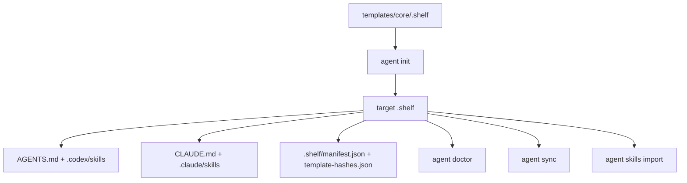

# Shelf-Aligned AgentOS Foundation Plan

## Problem Frame

AgentOS CLI currently installs a shared `.agent-os/` source and projects it into Codex and Claude Code files. Shelf points to a stronger foundation: one tool-neutral workspace with explicit `spec`, `tasks`, and `workspace` domains, plus portable skills projected into multiple AI coding tools. This plan adapts that architecture while keeping this project's branding and command surface.

The immediate goal is the foundation only. Vue/framework customization and team collaboration rule authoring are deferred.

---

## Requirements Traceability

- R1. Use Shelf as the highest architecture reference for context injection, task-driven workflows, worktree-oriented parallel execution, project memory, and multi-platform reuse.
- R2. Create or project a `.shelf/` workspace with `spec`, `tasks`, `workspace`, `skills`, `rules`, and `templates`.
- R3. Keep workflow skills but migrate names to the `agentos-*` prefix.
- R4. Remove the current Vue stack surface from CLI help, validation, README, and tests.
- R5. Preserve safe projection behavior: generated platform files should be tracked by metadata and sync should skip user-modified files.
- R6. Do not implement team collaboration rule definition yet.

---

## Scope Boundaries

### In Scope

- Rename the shared template root and runtime source from `.agent-os` to `.shelf`.
- Add foundational `.shelf/spec`, `.shelf/tasks`, and `.shelf/workspace` placeholders and guidance.
- Rename core workflow skill directories and frontmatter names to `agentos-*`.
- Update CLI internals, doctor, sync, import, gitignore entries, metadata, README, and tests for the `.shelf` structure.
- Keep Codex and Claude projections as generated outputs.

### Deferred to Follow-Up Work

- Vue/framework-specific skill packs and stack layering.
- Full Shelf task lifecycle commands such as `task create`, `task status`, worktree orchestration, or journal append commands.
- Migrating external Shelf skill content verbatim from the upstream repository.
- Team collaboration rule definition and policy authoring.

### Non-Goals

- Changing package name, binary name, or top-level command names in this pass.
- Adding new platform adapters beyond Codex and Claude Code.

---

## Key Technical Decisions

- **Adopt `.shelf` as the runtime source directory.** The Shelf model makes specs, tasks, and workspace memory first-class. Keeping `.agent-os` would preserve old names but miss the architectural reset requested here.
- **Keep command names for compatibility.** `agentos-cli agent init|sync|doctor|skills import` can install Shelf-shaped content without forcing users to relearn the CLI.
- **Collapse stacks to `core` for now.** The user explicitly deferred framework customization. Keeping `vue` in validation or README would advertise behavior that no longer exists.
- **Prefix skills as `agentos-*`.** This preserves AgentOS identity while borrowing Shelf's portable workflow shape.
- **Treat platform files as projections.** `AGENTS.md`, `CLAUDE.md`, `.codex/`, and `.claude/` remain generated from `.shelf` and protected by hashes.

---

## High-Level Technical Design

> Directional design only. Implementers should follow local code patterns rather than copying this as code.

---

## Implementation Units

- U1. **Core Shelf Runtime**

**Goal:** Replace the installed source root with `.shelf` and scaffold the foundational directories.

**Requirements:** R1, R2, R5

**Dependencies:** None

**Files:**
- Modify: `lib/utils/agent-os.js`
- Modify: `lib/actions/agent-init.js`
- Modify: `lib/actions/agent-sync.js`
- Modify: `lib/actions/agent-doctor.js`
- Create/Move: `templates/core/.shelf/**`
- Remove/Stop using: `templates/core/.agent-os/**`
- Test: `tests/agent-init.test.js`
- Test: `tests/agent-lifecycle.test.js`
- Test: `tests/agent-skills-import.test.js`

**Approach:**
- Introduce a single source-root constant for `.shelf`.
- Update conflict detection, metadata, projection collection, import destination resolution, doctor checks, and gitignore entries to use `.shelf`.
- Add placeholder README files under `spec`, `tasks`, and `workspace` so empty directories are packaged.

**Patterns to follow:**
- Existing projection/hash behavior in `lib/utils/agent-os.js`.
- Existing lifecycle tests for init, sync, and doctor.

**Test scenarios:**
- Happy path: `agent init` creates `.shelf`, `AGENTS.md`, and selected platform skills.
- Integration: `agent sync --dry-run` classifies missing and unchanged projected files from `.shelf`.
- Edge case: user-modified projection files are skipped during sync.
- Error path: `agent doctor` reports missing `.shelf/manifest.json`.

**Verification:**
- Tests assert no `.agent-os` directory is required for new installs.

---

- U2. **AgentOS Skill Prefix Migration**

**Goal:** Rename core workflow skills to `agentos-*` while retaining their existing workflow intent.

**Requirements:** R3

**Dependencies:** U1

**Files:**
- Create/Move: `templates/core/.shelf/skills/agentos-project-context/SKILL.md`
- Create/Move: `templates/core/.shelf/skills/agentos-planning/SKILL.md`
- Create/Move: `templates/core/.shelf/skills/agentos-implementation/SKILL.md`
- Create/Move: `templates/core/.shelf/skills/agentos-verification/SKILL.md`
- Create/Move: `templates/core/.shelf/skills/agentos-debugging/SKILL.md`
- Create/Move: `templates/core/.shelf/skills/agentos-documentation/SKILL.md`
- Modify: `templates/core/.shelf/rules/AGENTS.shared.md`
- Test: `tests/agent-init.test.js`
- Test: `tests/agent-lifecycle.test.js`

**Approach:**
- Rename skill directories and `name:` frontmatter.
- Update shared rules to load `agentos-*` skill names.
- Keep the skill bodies concise until upstream Shelf skill content is intentionally migrated in a later pass.

**Test scenarios:**
- Happy path: Codex projection contains `.codex/skills/agentos-planning/SKILL.md`.
- Integration: Claude projection contains the same prefixed skills.
- Edge case: old unprefixed skill names are not generated in fresh installs.

**Verification:**
- Tests fail if `project-context` or `planning` appears as a generated skill directory.

---

- U3. **Remove Deferred Vue Stack Surface**

**Goal:** Make the CLI advertise and validate only the foundational `core` stack.

**Requirements:** R4

**Dependencies:** None

**Files:**
- Modify: `lib/utils/agent-os.js`
- Modify: `lib/commands/agent.js`
- Modify: `README.md`
- Modify: `tests/agent-init.test.js`

**Approach:**
- Restrict `SUPPORTED_STACKS` to `core`.
- Update command help and README examples to remove `--stack vue`.
- Replace Vue-focused tests with core-foundation tests.

**Test scenarios:**
- Happy path: `--stack core` succeeds.
- Error path: `validateStack('vue')` rejects with available stack list showing only `core`.
- Documentation check: README examples no longer mention Vue installation.

**Verification:**
- `npm test` passes without any Vue template assumptions.

---

- U4. **Docs and User-Facing Language**

**Goal:** Explain the new Shelf-shaped foundation without overclaiming unbuilt features.

**Requirements:** R1, R2, R4, R6

**Dependencies:** U1, U2, U3

**Files:**
- Modify: `README.md`
- Modify: `templates/core/.shelf/README.md`
- Modify: `templates/core/.shelf/rules/AGENTS.shared.md`
- Modify: `templates/core/.shelf/templates/CLAUDE.md`

**Approach:**
- Describe `.shelf` as the shared source and platform files as projections.
- Name foundational directories and their roles.
- Mention worktree-oriented parallel execution as a supported workflow concept, not an implemented orchestration command.
- Explicitly defer framework packs and team collaboration rules.

**Test scenarios:**
- Test expectation: none -- documentation only, covered by manual review and projection tests that read shared rules.

**Verification:**
- README command examples match actual CLI behavior.

---

## System-Wide Impact

- **Interaction graph:** `agent init`, `agent sync`, `agent doctor`, and `agent skills import` all depend on the shared source root and must be updated together.
- **Error propagation:** missing source files should continue surfacing as explicit errors from assertion helpers.
- **State lifecycle risks:** existing users with `.agent-os` installs are not auto-migrated in this pass; new installs use `.shelf`.
- **API surface parity:** Codex and Claude projections should receive identical skill trees.
- **Integration coverage:** lifecycle tests should prove init -> doctor -> sync behavior.
- **Unchanged invariants:** package name, binary name, command names, projection hash tracking, and skip-on-user-modified sync behavior remain intact.

---

## Risks & Dependencies

| Risk | Mitigation |
|------|------------|
| Existing `.agent-os` users may need migration guidance. | Keep command names stable and document `.shelf` as the new source; add migration command later if needed. |
| Empty `spec/tasks/workspace` directories may be dropped by npm packaging. | Include README placeholder files in each directory. |
| Renaming skills breaks references in shared rules. | Update shared rules and tests to assert `agentos-*` projections. |
| Removing Vue stack invalidates older tests. | Replace Vue expectations with core foundation expectations. |

---

## Sources & References

- User request: Shelf architecture as highest reference, no team collaboration rules yet, Vue customization deferred, workflow skills migrated with `agentos-*` prefix.
- Architecture reference: user-provided Shelf foundation requirements and local AgentOS CLI patterns.
- Local patterns: `lib/utils/agent-os.js`, `lib/actions/agent-init.js`, `lib/actions/agent-sync.js`, `lib/actions/agent-doctor.js`, `lib/actions/agent-skills-import.js`, `tests/agent-lifecycle.test.js`
